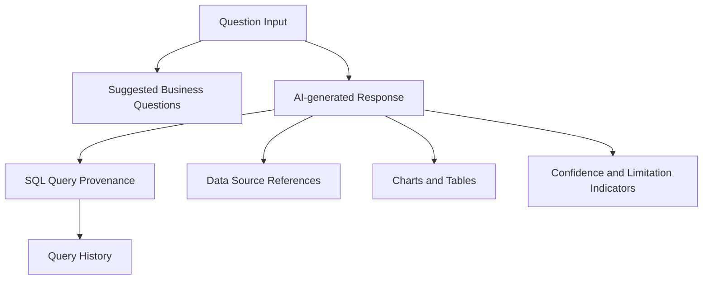

# Wireframe C: AI Intelligence Assistant

```mermaid
flowchart TB
    A[Question Input] --> B[Suggested Business Questions]
    A --> C[AI-generated Response]
    C --> D[SQL Query Provenance]
    C --> E[Data Source References]
    C --> F[Charts and Tables]
    C --> G[Confidence and Limitation Indicators]
    D --> H[Query History]
```
