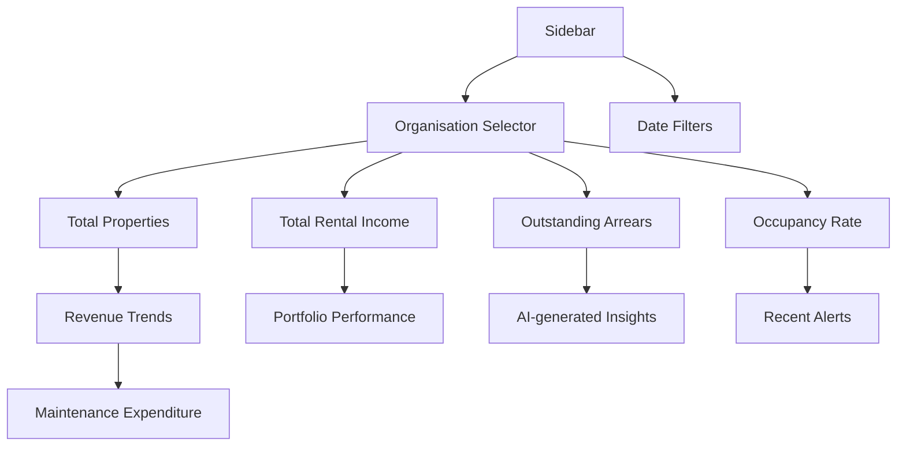

# Wireframe A: Enterprise Dashboard

```mermaid
flowchart TB
    A[Sidebar] --> B[Organisation Selector]
    A --> C[Date Filters]
    B --> D[Total Properties]
    B --> E[Total Rental Income]
    B --> F[Outstanding Arrears]
    B --> G[Occupancy Rate]
    D --> H[Revenue Trends]
    E --> I[Portfolio Performance]
    F --> J[AI-generated Insights]
    G --> K[Recent Alerts]
    H --> L[Maintenance Expenditure]
```
