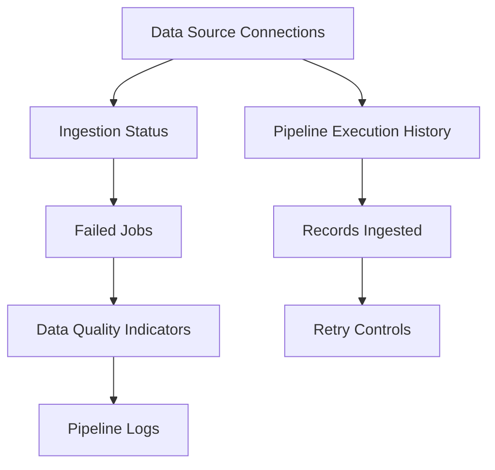

# Wireframe B: Data Engineering Console

```mermaid
flowchart TB
    A[Data Source Connections] --> B[Ingestion Status]
    A --> C[Pipeline Execution History]
    B --> D[Failed Jobs]
    C --> E[Records Ingested]
    D --> F[Data Quality Indicators]
    E --> G[Retry Controls]
    F --> H[Pipeline Logs]
```
