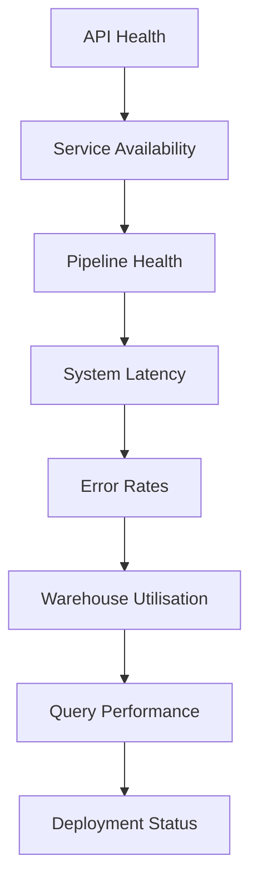

# Wireframe F: Infrastructure and Monitoring

```mermaid
flowchart TB
    A[API Health] --> B[Service Availability]
    B --> C[Pipeline Health]
    C --> D[System Latency]
    D --> E[Error Rates]
    E --> F[Warehouse Utilisation]
    F --> G[Query Performance]
    G --> H[Deployment Status]
```
