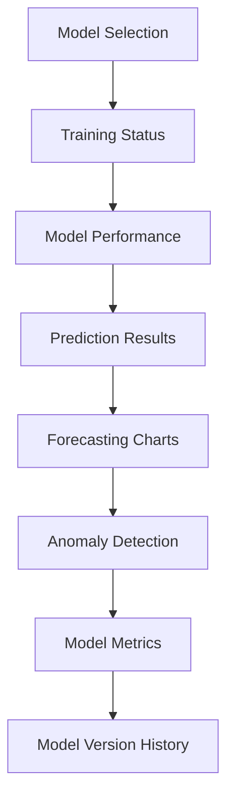

# Wireframe E: ML and Forecasting Dashboard

```mermaid
flowchart TB
    A[Model Selection] --> B[Training Status]
    B --> C[Model Performance]
    C --> D[Prediction Results]
    D --> E[Forecasting Charts]
    E --> F[Anomaly Detection]
    F --> G[Model Metrics]
    G --> H[Model Version History]
```
